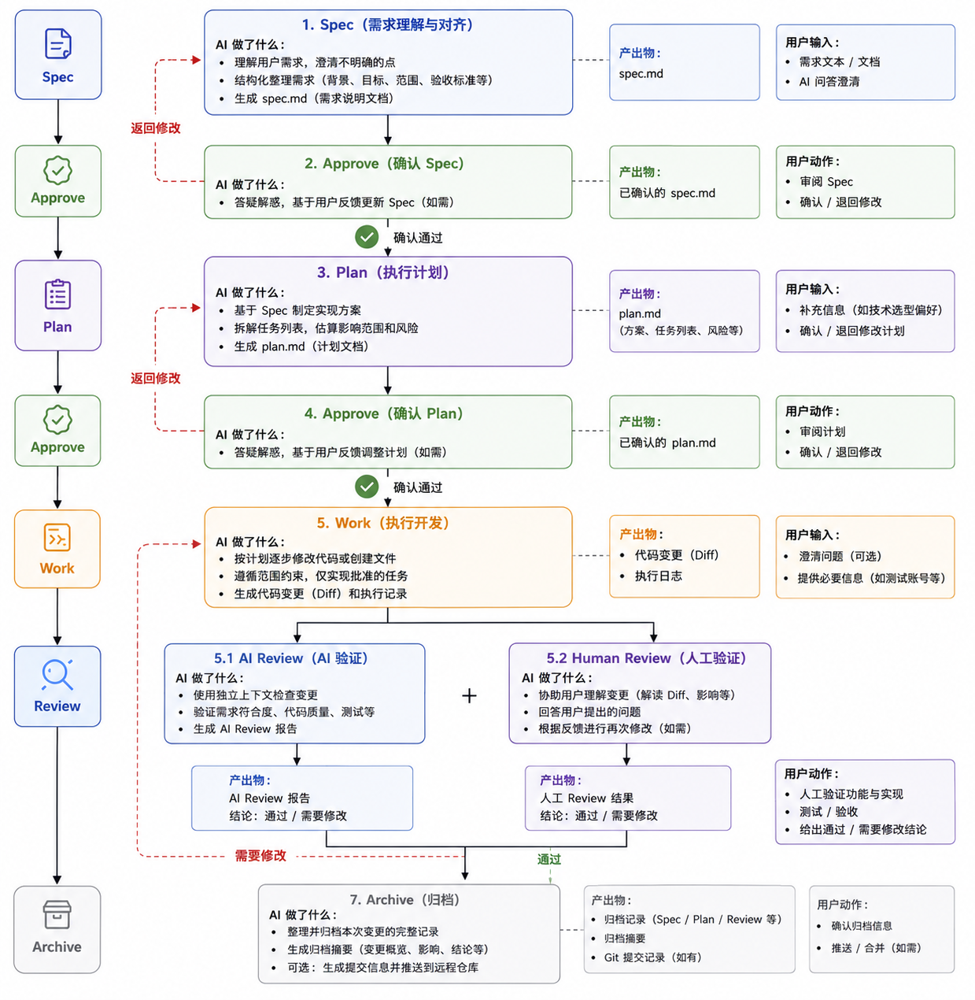

# mazda

> AI Coding 工作流引擎 —— 让 AI 编码遵循 Spec → Plan → Work → Review → Archive 五步流程

[](https://www.npmjs.com/package/@bondli/mazda)
[](LICENSE)

---

## 为什么需要 mazda？

直接让 AI 写代码，最常见的问题是：**需求没对齐就动手、改到一半偏离目标、没有 Review 就合并**。mazda 通过在对话中强制执行五个阶段，让每一次 AI Coding 都有迹可循、可审计、可回溯。

```
你说需求  →  AI 写 Spec  →  你确认  →  AI 写 Plan  →  你确认  →  AI 写代码  →  AI + 你 Review  →  归档
```

---

## 快速开始

### 安装

```bash
# 初始化到当前项目（同时支持 Claude Code 和 Codex）
npx @bondli/mazda init

# 只安装 Claude Code commands
npx @bondli/mazda init --target=claude-code

# 只安装 Codex 支持
npx @bondli/mazda init --target=codex
```

### 安装后的项目目录结构

`npx @bondli/mazda init` 会在你的项目中写入以下文件：

**目标为 Claude Code（`--target=claude-code`）：**

```
your-project/
├── .claude/
│   └── commands/
│       └── mazda/
│           ├── spec.md         /mazda spec 触发的自定义命令
│           ├── plan.md         /mazda plan 触发的自定义命令
│           ├── work.md         /mazda work 触发的自定义命令
│           ├── review.md       /mazda review 触发的自定义命令
│           └── archive.md      /mazda archive 触发的自定义命令
└── .mazda/
    └── state.json              工作流状态文件（常驻，初始 phase 为 idle）
```

**目标为 Codex（`--target=codex`）：**

```
your-project/
├── AGENTS.md                   已有内容保留，末尾追加 mazda 工作流指令块
└── .mazda/
    └── state.json              工作流状态文件（常驻，初始 phase 为 idle）
```

mazda 注入的内容用标记包裹，不会影响文件中已有的其他内容，重复执行 `init` 只会更新标记块之间的部分：

```markdown
<!-- mazda:begin -->
<!-- 此块由 mazda 自动管理，请勿手动编辑 -->
...mazda 工作流指令...
<!-- mazda:end -->
```

如需移除，执行 `npx @bondli/mazda uninstall --target=codex` 会干净删除该块，不影响文件其余内容。

**同时安装两者（`--target=both` 或不带参数）：**

```
your-project/
├── .claude/
│   └── commands/
│       └── mazda/
│           ├── spec.md
│           ├── plan.md
│           ├── work.md
│           ├── review.md
│           └── archive.md
├── AGENTS.md                   末尾追加 mazda 标记块
└── .mazda/
    └── state.json
```

> `.mazda/` 目录应纳入 git 版本控制，spec / plan / review 等产物是项目资产，不是临时文件。

---

### Claude Code 中使用

```
/mazda spec    开始需求澄清，生成 spec.md
/mazda plan    基于 spec 制定实施计划，生成 plan.md
/mazda work    按计划执行开发
/mazda review  AI 自动审查本次变更
/mazda archive 归档本次完整记录
```

### Codex 中使用

安装后 `AGENTS.md` 会自动注入工作流指令。只需在对话开头告诉 Codex：

```
请按照 mazda 工作流处理这个需求：[你的需求描述]
```

---

## 五个阶段详解



### 1. Spec — 需求澄清

**触发：** `/mazda spec` 或对话中描述需求

**AI 做了什么：**
1. 询问本次需求的名称，用于创建对应目录（如 `user-login`、`dark-mode` 等）
2. 读取用户输入的需求描述（可以是一句话，也可以是详细文档）
3. 主动追问，逐一澄清模糊点：目标用户是谁？边界在哪里？哪些明确不做？验收标准是什么？
4. 将澄清后的内容结构化，整理为统一格式：
   - **背景**：为什么要做这件事
   - **目标**：期望达到的结果
   - **范围**：具体做哪些，明确不做哪些
   - **验收标准**：怎么判断做完了、做对了
5. 将结果写入 `.mazda/<需求名>/spec.md`，并在对话中展示供审阅

**产出文件：**
| 文件 | 说明 |
|------|------|
| `.mazda/<需求名>/spec.md` | 结构化需求说明文档，后续所有阶段的输入基准 |
| `.mazda/state.json` | 阶段状态更新为 `spec`，记录当前需求名和创建时间 |

**推进到下一阶段：** 在对话中回复任意确认语，例如：
> "approve" / "确认" / "没问题，执行下一步" / "看起来不错，继续" / "ok go ahead"

支持带条件确认：
> "把验收标准补充一下：需要支持移动端，然后确认" / "去掉第三条范围，其他 approve"

AI 识别到确认意图后，更新 `state.json`，自动进入 Plan 阶段。

---

### 2. Plan — 执行计划

**触发：** Spec 被确认后自动进入，或直接 `/mazda plan`

**AI 做了什么：**
1. 读取已确认的 `.mazda/<需求名>/spec.md`，完整理解需求范围
2. 扫描项目代码结构，分析现有实现
3. 将目标拆解为有序任务列表，每个任务包含：具体操作、涉及文件、预期产出
4. 标注任务间依赖关系和执行顺序
5. 评估影响范围：哪些文件会新增 / 修改 / 删除
6. 识别潜在风险和需要特别注意的点
7. 将以上内容写入 `.mazda/<需求名>/plan.md`，并在对话中展示

**产出文件：**
| 文件 | 说明 |
|------|------|
| `.mazda/<需求名>/plan.md` | 实施计划，含任务列表、文件影响、风险说明 |
| `.mazda/state.json` | 阶段状态更新为 `plan` |

**推进到下一阶段：** 对话中确认即可，同样支持带条件确认：
> "把第 3 步拆成两步，然后确认" / "去掉数据库迁移部分，其他 approve"

---

### 3. Work — 执行开发

**触发：** Plan 被确认后自动进入，或直接 `/mazda work`

**AI 做了什么：**
1. 读取已确认的 `.mazda/<需求名>/plan.md`，以任务列表为唯一执行依据
2. 按顺序逐任务执行，每完成一个任务在对话中汇报进度
3. 严格遵守范围约束——**只做 plan 中批准的事**
4. 发现 plan 外的问题时，先在对话中提出，等待确认再决定是否处理
5. 所有代码变更完成后，生成执行摘要写入 `.mazda/<需求名>/work-log.md`

**产出文件：**
| 文件 | 说明 |
|------|------|
| 代码变更（git diff） | 实际修改的源码文件 |
| `.mazda/<需求名>/work-log.md` | 执行日志：每个任务的完成状态、实际变更描述、遇到的问题 |
| `.mazda/state.json` | 阶段状态更新为 `work` |

---

### 4. Review — 代码审查

**触发：** Work 完成后自动进入，或直接 `/mazda review`

包含两个部分：

**4.1 AI Review（自动完成）：**
1. 读取 `.mazda/<需求名>/plan.md` 和 `work-log.md`
2. 逐条核查：plan 中的每个任务是否都已实现
3. 检查代码质量：命名、结构、重复逻辑
4. 检查潜在问题：边界情况、安全隐患、性能风险
5. 核查变更是否超出 plan 批准的范围
6. 给出结论：**通过 / 需修改**，并列出每条问题的严重等级（阻断 / 建议 / 提示）
7. 将报告写入 `.mazda/<需求名>/review.md`

**4.2 Human Review（你来完成）：**
1. AI 用清晰的语言逐处解释改动的目的和影响，帮助你快速理解 diff
2. 回答你提出的任何问题
3. 根据你的反馈进行修改，修改后自动重新触发 AI Review

**产出文件：**
| 文件 | 说明 |
|------|------|
| `.mazda/<需求名>/review.md` | AI Review 报告，含问题清单、严重等级、最终结论 |
| `.mazda/state.json` | 阶段状态更新为 `review`，记录 AI Review 结论 |

**通过标准：** AI Review 无阻断问题 + 你在对话中确认通过。

---

### 5. Archive — 归档

**触发：** Review 通过后自动进入，或直接 `/mazda archive`

**AI 做了什么：**
1. 读取 `.mazda/<需求名>/` 下的所有产物
2. 生成归档摘要文档，包含：变更概述、影响的文件列表、主要决策记录、Review 结论
3. 将整个 `.mazda/<需求名>/` 目录**移动**到 `.mazda/archive/<需求名>/`，保持完整快照
4. 可选：生成规范的 git commit message，包含变更摘要和产物引用
5. 更新 `.mazda/state.json`，`phase` 重置为 `idle`，`requirement` 字段清空，准备接受下一个需求

**产出文件：**
| 文件 | 说明 |
|------|------|
| `.mazda/archive/<需求名>/summary.md` | 归档摘要：变更概述、影响范围、结论 |
| `.mazda/archive/<需求名>/spec.md` | 已确认的需求文档 |
| `.mazda/archive/<需求名>/plan.md` | 已确认的执行计划 |
| `.mazda/archive/<需求名>/work-log.md` | 执行日志 |
| `.mazda/archive/<需求名>/review.md` | AI Review 报告 |
| `.mazda/state.json` | 阶段重置为 `idle`，等待下一个需求 |

---

## 状态与产物目录结构

所有状态和产物存储在项目根目录的 `.mazda/` 下，**纳入 git 版本控制**：

```
.mazda/
├── state.json                  常驻文件，由 init 创建，归档后重置为 idle 而非删除
├── <需求名>/                   进行中的需求目录（同一时间只有一个）
│   ├── spec.md
│   ├── plan.md
│   ├── work-log.md
│   └── review.md
└── archive/
    ├── user-login/             归档后从上层移入，以需求名命名
    │   ├── summary.md
    │   ├── spec.md
    │   ├── plan.md
    │   ├── work-log.md
    │   └── review.md
    └── dark-mode/
        ├── summary.md
        └── ...
```

`state.json` 示例（Work 阶段进行中）：

```json
{
  "phase": "work",
  "requirement": "user-login",
  "approved": ["spec", "plan"],
  "spec": { "approved_at": "2024-01-15T09:00:00Z" },
  "plan": { "approved_at": "2024-01-15T09:30:00Z" }
}
```

`state.json` 示例（归档完成后，等待下一个需求）：

```json
{
  "phase": "idle",
  "requirement": null,
  "approved": []
}
```

---

## CLI 参考

```bash
npx @bondli/mazda init [--target=claude-code|codex|both]
# 初始化：安装 Claude Code commands / AGENTS.md，创建 .mazda/ 目录

npx @bondli/mazda status
# 显示当前需求名、阶段和各产物状态

npx @bondli/mazda reset [--phase=spec|plan|work|review]
# 重置到指定阶段（默认重置到 spec）

npx @bondli/mazda archive
# 手动触发归档（通常由 AI 在对话中完成）
```

---

## 项目结构（供开发者参考）

```
mazda/                          monorepo (pnpm workspaces)
├── packages/
│   ├── core/                   @bondli/mazda-core
│   │   ├── src/
│   │   │   ├── state.ts        状态机（读写 state.json、需求名校验）
│   │   │   ├── files.ts        .mazda/ 目录和文件读写
│   │   │   └── types.ts        阶段、状态和安装目标类型定义
│   │   └── package.json
│   │
│   ├── claude-code/            @bondli/mazda-claude-code
│   │   ├── commands/           预构建的 Claude Code 命令模板
│   │   │   ├── spec.md
│   │   │   ├── plan.md
│   │   │   ├── work.md
│   │   │   ├── review.md
│   │   │   └── archive.md
│   │   └── src/install.ts      将命令文件写入项目的 .claude/commands/mazda/
│   │
│   ├── codex/                  @bondli/mazda-codex
│   │   └── src/install.ts      生成并注入 AGENTS.md
│   │
│   └── cli/                    @bondli/mazda（CLI 主包，npx @bondli/mazda 入口）
│       └── src/index.ts        init / status / reset / archive
│
├── pnpm-workspace.yaml
└── tsconfig.base.json
```

---

## 设计原则

- **不强制，靠提示** — AI 通过 prompt 约束行为，不劫持工具调用
- **人始终掌控确认权** — 每个阶段必须人工确认才能推进，确认方式自然（对话语言即可）
- **产物是项目资产** — `.mazda/` 目录纳入 git，spec / plan / review 都是可追溯的文档
- **需求名作为唯一标识** — 进行中的需求直接放 `.mazda/<需求名>/`，归档后整目录移入 `archive/<需求名>/`，不用时间戳，始终可按名字找回；需求名只允许字母、数字和连字符，避免路径穿越风险。
- **无运行时守护进程** — Claude Code commands 是纯 Markdown，Codex 注入是纯文本，不需要后台服务
- **Prompt 可本地覆盖** — `.mazda/prompts/` 中的模板文件优先于包内默认模板

---

### 质量检查

```bash
pnpm build   # 编译所有 workspace 包
pnpm lint    # 运行 TypeScript noEmit 检查
pnpm test    # 运行核心文件操作和注入逻辑测试
pnpm check   # build + lint + test
```

### 发布说明

`@bondli/mazda` CLI 依赖 `@bondli/mazda-core`、`@bondli/mazda-claude-code` 和 `@bondli/mazda-codex`。发布到 npm 时需要四个 workspace 包保持相同版本并同步发布，确保 `npx @bondli/mazda init` 能解析到对应版本的内部包。

根目录 `package.json` 是 `private` monorepo 管理包，不作为 npm 包发布，因此不要在根目录直接执行 `pnpm publish`。直接执行会尝试发布根包，并因为根包没有 `version` 字段而报错：`ERR_PNPM_PACKAGE_VERSION_NOT_FOUND`。

整体发包请使用：

```bash
pnpm publish:packages:dry-run  # 发布前检查四个 workspace 包的产物
pnpm publish:packages          # 递归发布所有非 private workspace 包
```

---

## License

MIT
